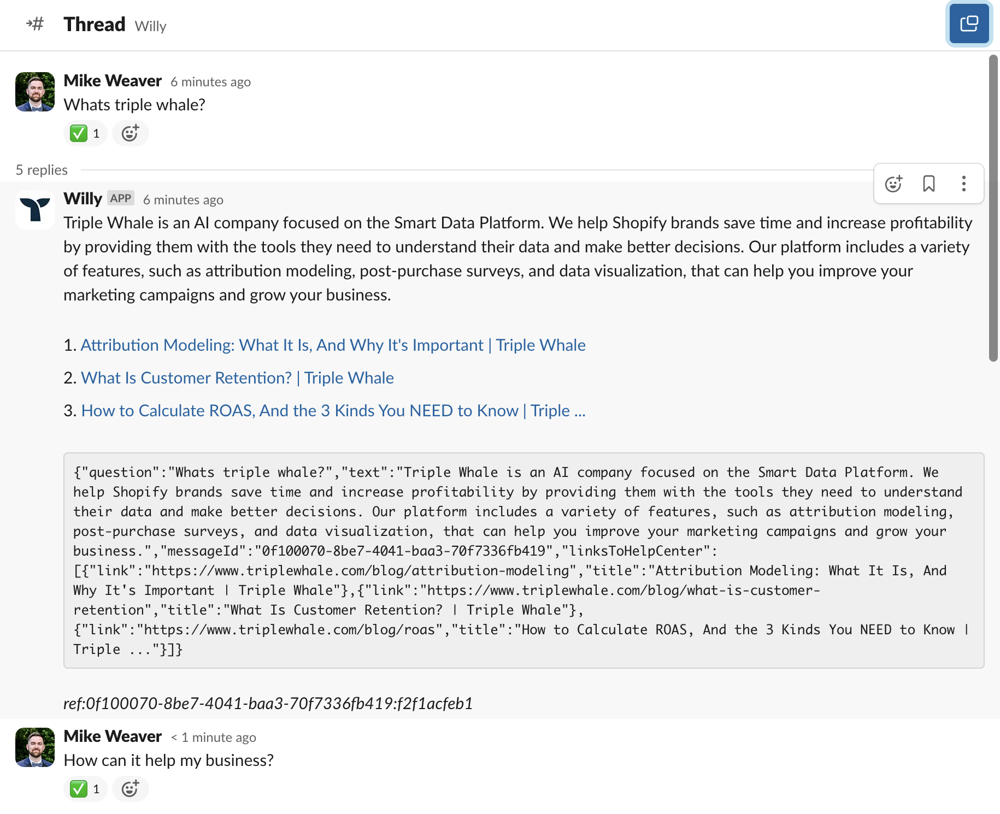
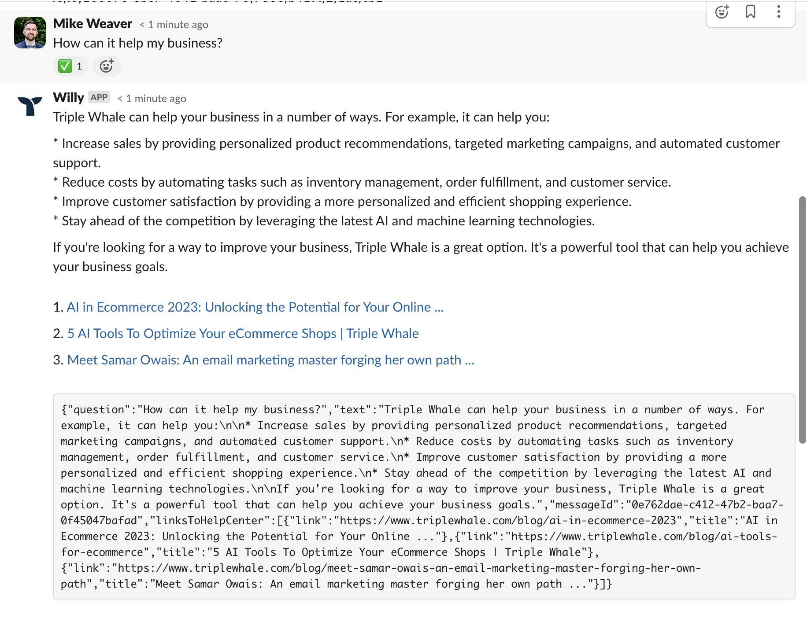
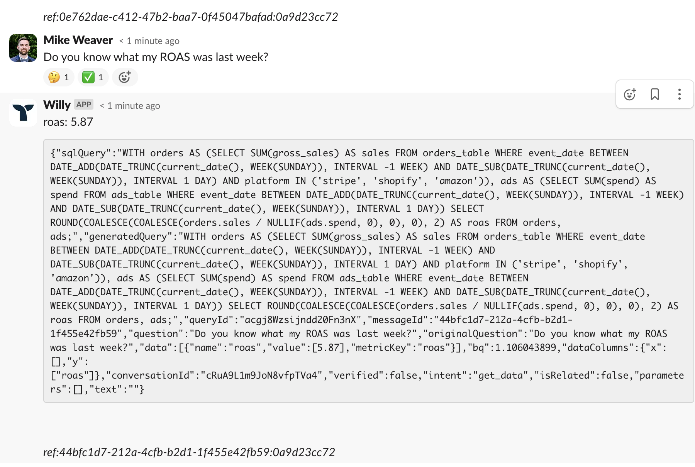

# 🐳 Willy Slack Bot

Inspired by [Lowkin's ChatGPT Slackbot](https://github.com/lokwkin/chatgpt-slackbot-node/tree/main)

## 🏁 Quickstart

```bash
yarn && yarn start
```

## 🟢 Usage

This slackbot listens to three types of event in slack workspace

  1. Directly message the bot in slack.
  1. Mention your bot in a channel with a question.
  1. ~~Slash command in a channel with a question.~~ @TODO

To ask a follow up question, reply in the answer thread, otherwise it will treat it as a new question.

## 🏳️ Start Modes

This app has two modes to start:

1. `slackbot` - listens to slack event for user requests, put request to redis queue, reply to slack on answer received.
2. `willy` - serves as queue worker that listens to queue, forward user's questions to willy, and put response back to queue on answer received.

NOTE: You need one instance of `slackbot` and one instance of `willy` to make this work.

### 💬 Slack Setup

1. Register a Slack App in [portal](https://api.slack.com/apps)
1. "Socket Mode" -> Enable Socket Mode
1. "OAuth & Permissions" -> Grant these permissions: `app_mentions:read`, `channels:history`, `chat:write`, `im:history`, `im:write`, `reactions:write`, `groups:history`
1. "Event Subscription" -> "Subscribe to bot events" -> Add `message.im` and `app_mention`
1. "App Home" -> "Message Tab" -> Check "Allow users to send Slash commands and messages from the messages tab"
1. Obtain your Bot Token from "OAuth & Permissions" > "Bot User OAuth Token"
1. Obtain your App Token from "Basic Information" > "App Level Token"
1. Enable slash commands and specify your command name; we don't need to specify the request URL as we are using socket mode.
1. "Install App" -> Reinstall in workspace if neccessary


## 🐋 Docker

The `Dockerfile` and `docker.compose` should enable you to host this app in a Docker container.

You can build and run the Docker image with the following commands:

```bash
# Build the image
yarn docker:build

# Run the image with redis locally
yarn docker:compose
```

### ☁️ GCP Cloud Run

The `cloudbuild.yaml` file should enable you to host this app on GCP Cloud Run.

You can build and run the Cloud Run image with the following commands:

```bash
# Build and deploy
gcloud run deploy
```

NOTE: You must enable MemoryStore Redis API and create a Redis instance in the same project. The IP will be used as the `REDIS_URL` environment variable in the Cloud Run instance.

### :accessibility: Environment Variables

|Key|required|description|
|--|--|--|
|`START_MODE`|Y|`slackbot` or `willy`|
|`REDIS_URL`|Y|Redis connection url, e.g.: `redis://redis:6379`|
|`SHOP_URL`|Y|Your shop URL, e.g.: `asdf.myshopify.com` |
|`SLACK_BOT_TOKEN`|Y|Your Slack Bot token. See https://api.slack.com/|
|`SLACK_APP_TOKEN`|Y|Your Slack App token. See https://api.slack.com/|
|`SLACK_BOT_USER_ID`|Y|The User ID of your Slack Bot. See https://api.slack.com/|
|`TW_TOKEN`|Y|The API token from triple whale|
|`SLACK_REACTION_LOADING`|N|The emoji to react when loading a question, default `thinking_face`|
|`SLACK_REACTION_SUCCESS`|N|The emoji to react when the prompt is answered, default `white_check_mark`|
|`SLACK_REACTION_FAILED`|N|The emoji to react when failed when processing, default `x`|
|`RESPONSE_QUEUE_NAME`|N|Queue name to use for listening for answers, default `queues.answers.slackbot`|

# :feelsgood: THIS IS A WORK IN PROGRESS :feelsgood:

